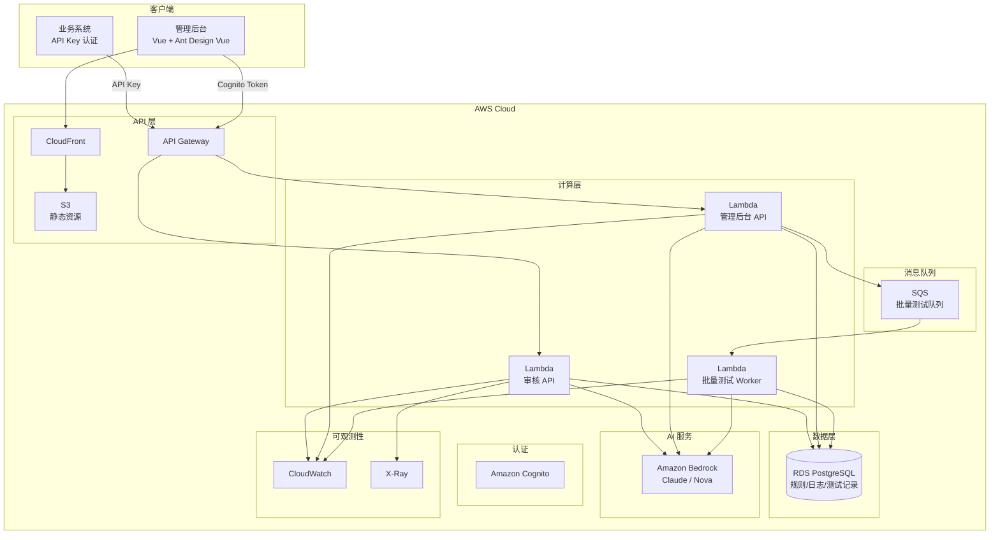
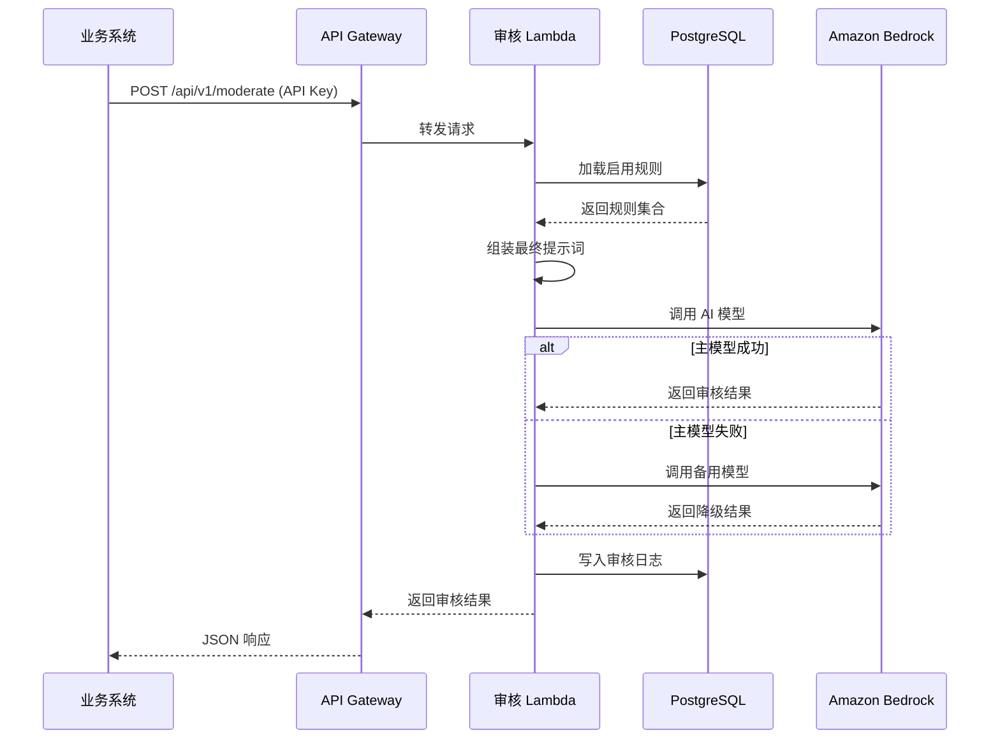

# 技术设计文档：商城评论内容审核系统

## 概述

本系统为商城评论提供自动化内容审核能力，通过动态可配置的审核规则驱动 Amazon Bedrock AI 模型对评论文本和图片进行审核。系统包含两个主要入口：面向业务系统的审核 API（API Key 认证）和面向产品经理的管理后台（Cognito 认证）。

系统日处理量约 2000 条评论，采用 Serverless 架构部署于 AWS，使用 Lambda + API Gateway 提供服务，SQS 处理异步任务，PostgreSQL 统一存储规则、测试记录和审核日志。

### 关键设计决策

| 决策 | 选择 | 理由 |
|------|------|------|
| 前端框架 | Vue 3 + Ant Design Vue | 用户指定，组件库成熟 |
| 后端框架 | Python FastAPI | 异步支持好，适合 AI 调用场景 |
| AI 服务 | Amazon Bedrock（多模型） | 支持 Claude/Nova 等模型，按性价比灵活切换 |
| 部署方式 | Lambda + API Gateway | Serverless，日 2000 条无需常驻服务 |
| 异步队列 | SQS | 批量测试解耦，削峰填谷 |
| 数据存储 | RDS PostgreSQL | 统一存储规则、测试记录和审核日志，简化架构 |
| 前端部署 | S3 + CloudFront | 静态资源 CDN 分发 |
| IaC | AWS CDK | TypeScript 类型安全，与 AWS 生态集成好 |

## 架构

### 系统架构图



### 请求流程




## 组件与接口

### 1. 审核 API 服务（Moderation API）

负责接收审核请求、协调规则引擎和 AI 模型、返回审核结果。

#### API 端点

| 方法 | 路径 | 认证 | 描述 |
|------|------|------|------|
| POST | /api/v1/moderate | API Key | 提交内容审核 |
| GET | /api/v1/moderate/{taskId} | API Key | 查询审核结果 |

#### 请求/响应格式

```json
// POST /api/v1/moderate 请求
{
  "text": "评论文本内容（可选）",
  "image_url": "图片URL或S3路径（可选）",
  "business_type": "商品评论",
  "callback_url": "https://example.com/callback（可选）"
}

// POST /api/v1/moderate 响应
{
  "task_id": "uuid",
  "status": "completed",
  "result": "pass|reject|review|flag",
  "text_label": "safe|spam|toxic|hate_speech|privacy_leak|political|self_harm|illegal_trade|misleading",
  "image_label": "无|pornography|gambling|drugs|violence|terrorism|qr_code_spam|contact_info|ad_overlay|minor_exploitation",
  "confidence": 0.95,
  "matched_rules": [
    {"rule_id": "uuid", "rule_name": "违禁词检测", "action": "reject"}
  ],
  "degraded": false,
  "processing_time_ms": 1200
}
```

### 2. 规则引擎（Rule Engine）

核心组件，负责规则加载、提示词模板解析和最终提示词组装。

#### 接口定义

```python
class RuleEngine:
    async def get_active_rules(self, business_type: str | None = None) -> list[Rule]:
        """从 PostgreSQL 加载启用的规则集合"""

    async def get_enabled_labels(self, label_type: str | None = None) -> list[LabelDefinition]:
        """从 PostgreSQL 动态加载启用的标签定义，用于组装提示词中的标签指令"""

    def render_template(self, template: str, variables: dict[str, str]) -> str:
        """将模板中的 {{variable}} 占位符替换为变量值"""

    def assemble_prompt(self, rules: list[Rule], content: ModerationContent, labels: list[LabelDefinition] | None = None) -> str:
        """按优先级组装基础模板 + 各规则提示词片段为最终提示词，动态注入启用的标签列表"""
```

### 3. AI 模型调用器（Model Invoker）

封装 Amazon Bedrock 调用逻辑，支持多模型切换和降级。

```python
class ModelInvoker:
    async def invoke(
        self, prompt: str, images: list[bytes] | None, model_config: ModelConfig
    ) -> ModelResponse:
        """调用 Bedrock 模型，失败时按降级策略处理"""

    async def invoke_with_fallback(
        self, prompt: str, images: list[bytes] | None, model_config: ModelConfig
    ) -> ModelResponse:
        """主模型失败后自动切换备用模型"""

@dataclass
class ModelResponse:
    """AI 模型返回的结构化结果"""
    result: str          # pass / reject / review / flag
    text_label: str      # safe/spam/toxic/hate_speech/privacy_leak/political/self_harm/illegal_trade/misleading
    image_label: str     # 无/pornography/gambling/drugs/violence/terrorism/qr_code_spam/contact_info/ad_overlay/minor_exploitation
    confidence: float
    matched_rules: list[dict]
    raw_response: str
    degraded: bool
    model_id: str
```

### 4. 图片获取器（Image Fetcher）

统一处理公网 URL 和 S3 路径两种图片来源。

```python
class ImageFetcher:
    async def fetch(self, image_url: str) -> bytes:
        """根据 URL 前缀判断来源，获取图片二进制内容
        - s3:// 前缀：通过 AWS SDK 获取
        - http(s):// 前缀：通过 HTTP 获取
        """
```

### 5. 管理后台 API（Admin API）

提供规则管理、日志查询、批量测试、模型配置、数据统计等管理功能。

#### API 端点

| 方法 | 路径 | 描述 |
|------|------|------|
| GET/POST/PUT/DELETE | /api/admin/rules | 规则 CRUD |
| GET | /api/admin/rules/{id}/versions | 规则版本历史 |
| POST | /api/admin/prompt/preview | 提示词预览 |
| POST | /api/admin/prompt/test | 提示词测试（调用 AI） |
| GET | /api/admin/logs | 审核日志列表（筛选） |
| GET | /api/admin/logs/{id} | 审核日志详情 |
| POST | /api/admin/logs/export | 导出审核日志 |
| POST | /api/admin/test-suites/upload | 上传测试集 |
| POST | /api/admin/test-suites/{id}/run | 启动批量测试 |
| GET | /api/admin/test-suites/{id}/progress | 测试进度查询 |
| GET | /api/admin/test-suites/{id}/report | 测试报告 |
| POST | /api/admin/test-suites/{id}/export | 导出测试报告 |
| GET | /api/admin/test-records | 历史测试记录 |
| POST | /api/admin/test-records/compare | 测试记录对比 |
| GET/PUT | /api/admin/model-config | 模型配置 |
| GET | /api/admin/stats/volume | 审核量趋势 |
| GET | /api/admin/stats/rule-hits | 规则命中率 |
| GET | /api/admin/stats/cost | 模型调用成本 |
| GET | /api/admin/stats/text-labels | 文案标签分布统计 |
| GET | /api/admin/stats/image-labels | 图片标签分布统计 |
| GET | /api/admin/stats/languages | 语言分布统计 |
| GET/POST/PUT/DELETE | /api/admin/labels | 标签定义 CRUD |

### 6. 批量测试 Worker

SQS 触发的 Lambda，逐条执行测试用例并汇总结果。

```python
class BatchTestWorker:
    async def process_test_suite(self, test_suite_id: str, rule_ids: list[str]) -> None:
        """从 SQS 接收任务，逐条调用审核流程，更新进度，生成报告"""

    def calculate_metrics(
        self, results: list[TestCaseResult]
    ) -> TestReport:
        """计算准确率、召回率、F1、混淆矩阵等指标"""
```

### 7. 前端管理后台（Admin Console）

Vue 3 + Ant Design Vue 单页应用，主要页面：

- 规则管理页：规则列表、创建/编辑表单、提示词模板编辑器
- 提示词预览页：规则组合选择、最终提示词展示、在线测试
- 审核日志页：日志列表（筛选/分页）、日志详情抽屉、导出
- 批量测试页：上传测试集、选择规则、执行测试、查看报告、导出
- 测试记录页：历史记录列表、结果对比
- 模型配置页：模型选择、参数调整、降级策略、成本参考
- 数据统计页：审核量趋势图、规则命中率、成本统计、文案标签分布、图片标签分布、语言分布
- 标签管理页：标签列表（按类型分 Tab）、创建/编辑表单、启用/禁用、删除


## 数据模型

### PostgreSQL 表结构

#### rules 表（审核规则）

| 字段 | 类型 | 说明 |
|------|------|------|
| id | UUID | 主键 |
| name | VARCHAR(200) | 规则名称 |
| type | VARCHAR(20) | 类型：text / image / both |
| business_type | VARCHAR(100) | 适用业务类型 |
| prompt_template | TEXT | 提示词模板，支持 {{variable}} |
| variables | JSONB | 变量配置 {"competitor_list": ["品牌A","品牌B"]} |
| action | VARCHAR(20) | 触发动作：reject / review / flag |
| priority | INTEGER | 优先级，数值越小越优先 |
| enabled | BOOLEAN | 启用状态 |
| created_at | TIMESTAMP | 创建时间 |
| updated_at | TIMESTAMP | 更新时间 |

#### rule_versions 表（规则版本历史）

| 字段 | 类型 | 说明 |
|------|------|------|
| id | UUID | 主键 |
| rule_id | UUID | 关联规则 ID |
| version | INTEGER | 版本号 |
| snapshot | JSONB | 规则完整快照 |
| modified_by | VARCHAR(100) | 修改人 |
| modified_at | TIMESTAMP | 修改时间 |
| change_summary | TEXT | 修改摘要 |

#### model_config 表（模型配置）

| 字段 | 类型 | 说明 |
|------|------|------|
| id | UUID | 主键 |
| model_id | VARCHAR(100) | Bedrock 模型 ID |
| model_name | VARCHAR(100) | 显示名称 |
| temperature | FLOAT | 温度参数 |
| max_tokens | INTEGER | 最大输出长度 |
| is_primary | BOOLEAN | 是否为主模型 |
| is_fallback | BOOLEAN | 是否为备用模型 |
| fallback_result | VARCHAR(20) | 降级默认结果 |
| cost_per_1k_input | FLOAT | 每千 token 输入成本参考 |
| cost_per_1k_output | FLOAT | 每千 token 输出成本参考 |
| updated_at | TIMESTAMP | 更新时间 |

#### test_suites 表（测试集）

| 字段 | 类型 | 说明 |
|------|------|------|
| id | UUID | 主键 |
| name | VARCHAR(200) | 测试集名称 |
| file_key | VARCHAR(500) | S3 文件路径 |
| total_cases | INTEGER | 用例总数 |
| created_at | TIMESTAMP | 创建时间 |

#### test_records 表（测试记录）

| 字段 | 类型 | 说明 |
|------|------|------|
| id | UUID | 主键 |
| test_suite_id | UUID | 关联测试集 |
| rule_ids | JSONB | 使用的规则 ID 列表 |
| model_config_snapshot | JSONB | 模型配置快照 |
| status | VARCHAR(20) | 状态：pending / running / completed / failed |
| progress_current | INTEGER | 当前完成数 |
| progress_total | INTEGER | 总数 |
| report | JSONB | 测试报告（准确率、召回率、F1、混淆矩阵等） |
| started_at | TIMESTAMP | 开始时间 |
| completed_at | TIMESTAMP | 完成时间 |

#### moderation_logs 表（审核日志）

| 字段 | 类型 | 说明 |
|------|------|------|
| id | UUID | 主键 |
| task_id | VARCHAR(36) | 审核任务 ID，唯一索引 |
| status | VARCHAR(20) | pending / processing / completed / failed |
| input_text | TEXT | 原始评论文本 |
| input_image_url | VARCHAR(1000) | 原始图片 URL |
| business_type | VARCHAR(100) | 业务类型 |
| final_prompt | TEXT | 最终组装的提示词 |
| model_response | TEXT | AI 模型原始响应 |
| result | VARCHAR(20) | pass / reject / review / flag |
| text_label | VARCHAR(50) | 文案分类标签：safe/spam/toxic/hate_speech/privacy_leak/political/self_harm/illegal_trade/misleading |
| image_label | VARCHAR(50) | 图片分类标签：无/pornography/gambling/drugs/violence/terrorism/qr_code_spam/contact_info/ad_overlay/minor_exploitation |
| confidence | FLOAT | 置信度 |
| matched_rules | JSONB | 命中规则列表 |
| processing_time_ms | INTEGER | 处理耗时（毫秒） |
| degraded | BOOLEAN | 是否降级处理 |
| model_id | VARCHAR(100) | 使用的模型 ID |
| language | VARCHAR(10) | 审核内容的语言代码（ISO 639-1，如 en、zh、fr） |
| created_at | TIMESTAMP | 创建时间 |

索引：
- `idx_logs_result_created`：(result, created_at) 按审核结果 + 时间查询
- `idx_logs_business_type_created`：(business_type, created_at) 按业务类型 + 时间查询
- `idx_logs_task_id`：(task_id) 唯一索引，按任务 ID 查询
- `idx_logs_text_label_created`：(text_label, created_at) 按文案标签 + 时间查询
- `idx_logs_image_label_created`：(image_label, created_at) 按图片标签 + 时间查询
- `idx_logs_language_created`：(language, created_at) 按语言 + 时间查询

新增字段：
- `language` VARCHAR(10)：审核内容的语言代码（ISO 639-1，如 en、zh、fr）

#### label_definitions 表（标签定义）

| 字段 | 类型 | 说明 |
|------|------|------|
| id | UUID | 主键 |
| label_key | VARCHAR(50) | 标签唯一标识（如 spam、toxic），唯一索引 + label_type 联合唯一 |
| label_type | VARCHAR(10) | 标签类型：text / image |
| display_name | VARCHAR(100) | 显示名称（中文说明，如"垃圾广告"） |
| description | TEXT | 标签详细描述 |
| action | VARCHAR(20) | 处置动作：pass / reject / reject_warn / reject_report |
| enabled | BOOLEAN | 启用状态，默认 true |
| sort_order | INTEGER | 排序序号，数值越小越靠前 |
| created_at | TIMESTAMP | 创建时间 |
| updated_at | TIMESTAMP | 更新时间 |

索引：
- `uq_label_key_type`：(label_key, label_type) 联合唯一索引
- `idx_label_type_enabled`：(label_type, enabled) 按类型和启用状态查询


## 正确性属性

*属性（Property）是指在系统所有有效执行中都应成立的特征或行为——本质上是对系统应做什么的形式化陈述。属性是人类可读规格说明与机器可验证正确性保证之间的桥梁。*

### Property 1: 图片 URL 路由正确性

*For any* URL 字符串，如果以 `s3://` 前缀开头，ImageFetcher 应路由到 S3 获取策略；如果以 `http://` 或 `https://` 前缀开头，应路由到 HTTP 获取策略；其他前缀应返回错误。

**Validates: Requirements 1.4**

### Property 2: 审核请求输入验证

*For any* 审核请求，当 text 和 image_url 均为空（null、空字符串或纯空白字符串）时，验证应拒绝该请求；当至少有一个字段包含非空白内容时，验证应通过。

**Validates: Requirements 1.5**

### Property 3: 规则必填字段验证

*For any* 规则创建/更新请求，当缺少任意必填字段（name、type、prompt_template、action、priority）时，验证应拒绝该请求；当所有必填字段都有有效值时，验证应通过。

**Validates: Requirements 3.2**

### Property 4: Excel 测试集格式验证

*For any* 测试集数据，当包含所有必要列（序号、内容文本、图片URL、期望结果、业务类型、备注）且期望结果值在 {pass, reject, review, flag} 范围内时，格式验证应通过；当缺少必要列或期望结果值不合法时，验证应拒绝。

**Validates: Requirements 6.1, 6.2**

### Property 5: 测试指标计算数学正确性

*For any* 一组（期望结果, 实际结果）对，计算得到的混淆矩阵中 TP + FP + TN + FN 应等于总样本数，且准确率应等于 (TP + TN) / 总数，召回率和 F1 分数应满足对应的数学公式。

**Validates: Requirements 6.4**

### Property 6: 模板变量替换往返一致性

*For any* 有效的提示词模板和完整的变量映射（覆盖模板中所有 {{variable}} 占位符），经过 render_template 处理后的结果字符串中不应包含任何 `{{...}}` 格式的占位符，且每个变量的值应出现在结果中对应的位置。

**Validates: Requirements 12.1, 12.3**

### Property 7: 规则提示词按优先级排序拼接

*For any* 启用规则集合（每条规则有不同的优先级和提示词片段），assemble_prompt 生成的最终提示词中，各规则片段的出现顺序应与规则优先级从高到低（数值从小到大）的顺序一致。

**Validates: Requirements 12.4, 3.5, 4.3**

### Property 8: 标签定义 CRUD 完整性

*For any* 标签定义创建请求，当缺少任意必填字段（label_key、label_type、display_name、action）时，验证应拒绝该请求；当所有必填字段都有有效值且 (label_key, label_type) 组合唯一时，创建应成功。创建后通过 GET 查询应返回该标签定义。

**Validates: Requirements 14.1, 14.2**

### Property 9: 动态标签注入提示词一致性

*For any* 启用的标签定义集合，assemble_prompt 生成的最终提示词中应包含所有启用标签的 label_key，且不应包含任何已禁用标签的 label_key。

**Validates: Requirements 14.3, 14.4**


## 标签分类系统设计

### 标签枚举定义

基于真实测试数据集（100 条评论，覆盖 7 种语言）分析得出的标签体系。

#### Text_Label（文案标签，9 类）

| 标签值 | 含义 | 处置动作 |
|--------|------|----------|
| safe | 正常/安全内容 | 通过 |
| spam | 垃圾广告/引流/推广 | 拒绝 |
| toxic | 辱骂/人身攻击/脏话 | 拒绝 |
| hate_speech | 仇恨/歧视/种族主义 | 拒绝 |
| privacy_leak | 泄露个人隐私信息 | 拒绝 |
| political | 政治敏感内容 | 拒绝 |
| self_harm | 自残/自杀暗示 | 拒绝 + 预警 |
| illegal_trade | 违法交易暗示 | 拒绝 |
| misleading | 虚假宣传/误导性信息 | 拒绝 |

#### Image_Label（图片标签，9 类 + 无）

| 标签值 | 含义 | 处置动作 |
|--------|------|----------|
| 无 | 无图片或安全图片 | 通过 |
| pornography | 涉黄内容 | 拒绝 |
| gambling | 涉赌内容 | 拒绝 |
| drugs | 涉毒内容 | 拒绝 |
| violence | 暴力/血腥内容 | 拒绝 |
| terrorism | 恐怖主义符号 | 拒绝 |
| qr_code_spam | 二维码引流 | 拒绝 |
| contact_info | 图片水印联系方式 | 拒绝 |
| ad_overlay | 广告覆盖图 | 拒绝 |
| minor_exploitation | 未成年人保护相关 | 拒绝 + 上报 |

### 标签到动作映射规则

```
IF text_label == "safe" AND image_label == "无":
    result = "pass"
ELSE:
    result = "reject"

IF text_label == "self_harm":
    附加预警标记
IF image_label == "minor_exploitation":
    附加上报标记
```

### 提示词模板标签指令

AI 模型提示词中须包含标签分类指令，要求模型在 JSON 响应中输出 `text_label` 和 `image_label` 字段。提示词模板示例片段：

```
你必须在响应 JSON 中包含以下字段：
- text_label: 文案分类标签，取值范围 [safe, spam, toxic, hate_speech, privacy_leak, political, self_harm, illegal_trade, misleading]
- image_label: 图片分类标签，取值范围 [无, pornography, gambling, drugs, violence, terrorism, qr_code_spam, contact_info, ad_overlay, minor_exploitation]
```

### 批量测试标签对比

批量测试 Worker 在对比结果时，除了对比 result（pass/reject）外，还需对比 text_label 和 image_label，并在测试报告中增加标签准确率指标。


## 动态标签配置设计

### 概述

将 Text_Label 和 Image_Label 从硬编码枚举改为数据库驱动的动态配置，通过 Admin Console 的标签管理页面进行 CRUD 操作。RuleEngine 在组装提示词时动态加载启用的标签定义，确保标签变更即时生效。

### 标签定义 CRUD API

#### 请求/响应格式

```json
// GET /api/admin/labels?label_type=text&enabled=true
// 响应
{
  "items": [
    {
      "id": "uuid",
      "label_key": "spam",
      "label_type": "text",
      "display_name": "垃圾广告",
      "description": "垃圾广告/引流/推广内容",
      "action": "reject",
      "enabled": true,
      "sort_order": 1,
      "created_at": "2024-01-01T00:00:00Z",
      "updated_at": "2024-01-01T00:00:00Z"
    }
  ],
  "total": 19
}

// POST /api/admin/labels 请求
{
  "label_key": "new_label",
  "label_type": "text",
  "display_name": "新标签",
  "description": "新标签描述",
  "action": "reject",
  "enabled": true,
  "sort_order": 10
}

// PUT /api/admin/labels/{id} 请求
{
  "display_name": "更新后的名称",
  "action": "reject_warn",
  "enabled": false
}
```

### 提示词动态标签注入

RuleEngine.assemble_prompt 在组装提示词时，从 label_definitions 表加载所有 enabled=true 的标签，按 sort_order 排序后生成标签指令片段：

```
你必须在响应 JSON 中包含以下字段：
- text_label: 文案分类标签，取值范围 [{动态加载的 text 类型标签 label_key 列表}]
- image_label: 图片分类标签，取值范围 [{动态加载的 image 类型标签 label_key 列表}]

各标签含义：
{动态加载的各标签 label_key: display_name - description}
```

### 默认标签种子数据

首次部署时通过数据库迁移脚本初始化默认标签：

- Text 类型（9 个）：safe、spam、toxic、hate_speech、privacy_leak、political、self_harm、illegal_trade、misleading
- Image 类型（10 个）：无、pornography、gambling、drugs、violence、terrorism、qr_code_spam、contact_info、ad_overlay、minor_exploitation

### 前端标签管理页面

Admin Console 新增标签管理页面（/admin/labels），包含：
- 标签列表表格（按 label_type 分 Tab 展示，支持排序和筛选）
- 创建/编辑标签弹窗表单
- 启用/禁用开关
- 删除确认对话框
- 拖拽排序或手动输入 sort_order


## 增强数据统计设计

### 概述

在现有数据统计页面（审核量趋势、规则命中率、成本统计）基础上，新增文案标签分布、图片标签分布和语言分布三个统计维度。所有新增图表支持日期范围过滤。

### 新增统计 API

#### GET /api/admin/stats/text-labels

```json
// 请求参数：start_date, end_date
// 响应
{
  "items": [
    {"label": "safe", "display_name": "正常/安全内容", "count": 1500},
    {"label": "spam", "display_name": "垃圾广告", "count": 200},
    {"label": "toxic", "display_name": "辱骂/人身攻击", "count": 80}
  ],
  "total": 2000
}
```

#### GET /api/admin/stats/image-labels

```json
// 请求参数：start_date, end_date
// 响应
{
  "items": [
    {"label": "无", "display_name": "无图片或安全图片", "count": 1800},
    {"label": "pornography", "display_name": "涉黄内容", "count": 30}
  ],
  "total": 2000
}
```

#### GET /api/admin/stats/languages

```json
// 请求参数：start_date, end_date
// 响应
{
  "items": [
    {"language": "zh", "count": 1200},
    {"language": "en", "count": 500},
    {"language": "fr", "count": 100}
  ],
  "total": 2000
}
```

### 语言检测

Moderation_API 在审核流程中检测评论内容的语言，将 ISO 639-1 语言代码存储到 moderation_logs 表的 language 字段。可使用轻量级语言检测库（如 langdetect 或 lingua）实现。

### 前端图表

StatsPage.vue 新增三个图表区域：
- 文案标签分布：饼图或柱状图，展示各 text_label 的命中数量和占比
- 图片标签分布：饼图或柱状图，展示各 image_label 的命中数量和占比
- 语言分布：饼图或柱状图，展示各语言的审核数量和占比
- 所有图表共享页面顶部的日期范围选择器


## 错误处理

### API 层错误处理

| 错误场景 | HTTP 状态码 | 处理方式 |
|----------|------------|----------|
| 请求缺少必要字段 | 400 | 返回字段级错误描述 |
| API Key 无效或缺失 | 401 | 返回认证错误 |
| Cognito Token 无效或过期 | 401 | 前端重定向到登录页 |
| 资源不存在（taskId 等） | 404 | 返回资源未找到描述 |
| 请求体格式错误 | 422 | 返回 FastAPI 验证错误详情 |
| 服务内部错误 | 500 | 记录错误日志，返回通用错误信息 |

### AI 模型调用错误处理

```
主模型调用
  ├── 成功 → 返回结果
  └── 失败（超时/错误）
       ├── 有备用模型 → 调用备用模型
       │    ├── 成功 → 返回结果（标记 degraded=true）
       │    └── 失败 → 返回默认审核结果（标记 degraded=true）
       └── 无备用模型 → 返回默认审核结果（标记 degraded=true）
```

### 模板解析错误

- 未定义变量：替换为空字符串，记录警告日志
- 模板语法错误：记录错误日志，跳过该规则片段

### 批量测试错误

- 单条用例失败不影响整体测试，记录失败原因继续执行
- 整体任务失败（如 SQS 消息丢失）：标记任务状态为 failed，支持重试

## 测试策略

### 功能测试

使用 `pytest` 编写基础功能测试，确保核心流程正常运行：

- 审核 API 请求/响应（文本、图片、文本+图片）
- 输入验证（空内容拒绝、无效 API Key 拒绝）
- 规则 CRUD 操作
- 提示词模板变量替换
- 提示词按优先级组装
- 批量测试 Excel 解析和指标计算
- 模型降级策略

真实测试数据由客户后续提供，用于验收阶段的端到端验证。

